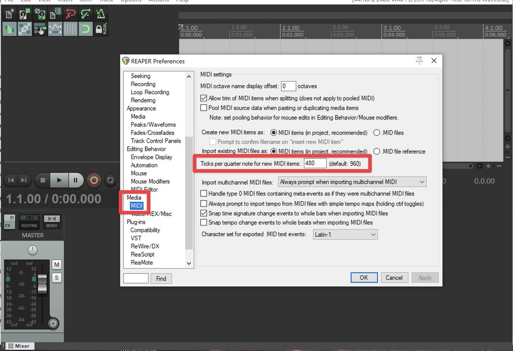
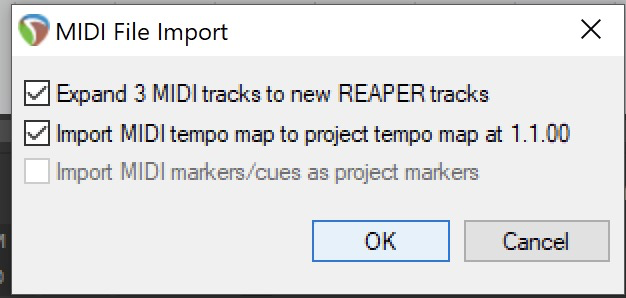
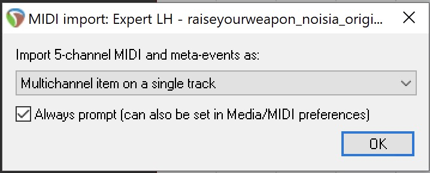

# Authoring

## MIDI Authoring

This is the official community maps authoring guide.

Things that you need to know for custom song authoring will be bolded
and **red**.

Things that are new and useful for community map authoring will be
bolded and **green**.

To make the distinction: Community maps are alternate versions of songs
in the game. It works with the official songs, it also works with custom
songs, not to be mixed with actual custom songs that are brand new songs
to play to. This guide covers community map authoring in MIDI format,
but it contains alot of information useful for any format and links to
relevant information.

### Community Maps README v0.1

**(c)2019 Harmonix Music Systems, Inc.** All rights reserved. Audica and
the Community Maps feature are developed by Harmonix Music Systems, Inc.
Audica, Harmonix and all related titles and logos are trademarks of
Harmonix Music Systems, Inc.

By using the Audica Community Maps feature, scripts and tools, you
accept all terms and conditions set forth in the End User License
Agreement (EULA) for Audica, which can be found at
<https://github.com/jalovatt/Lokasenna_GUI>

**Reaper templates** can be found in your **game folder** or can be
downloaded from <https://bsaber.com/downloads/community_maps.zip> if you
don't have the game.

### Preface: An Overview of MIDI

**Audica maps** can be created with either **MIDI data** or **JSON
data** (in a "cue" file format).

If you're not familiar with "Midi," MIDI is a **simple computer file
format** for **storing music note data**. It allows for up to *128*
different notes to be assigned to all kinds of different things (really,
anything in the world). If you were recording a full-size piano in MIDI
for example (since a full-size piano has 88 keys) 88 of those 128
available midi notes would be used for the different piano keys.

MIDI not only records **whether a note** has been **pressed or not**
during a **specific period of time** (with a **specific BPM** and **time
signature**), but how **hard** that note was pressed (think about a
piano playing softly vs. banging loudly on the notes). This is the
note's **velocity**

As mentioned, MIDI is often used for recording **virtual instruments**
(like a keyboard), but could really be used to record anything. You
could create a lightshow by assigning different lights in your house to
each of those 128 notes if you wanted. You could assign your garage door
opener to open the door with a MIDI note (if you were crazy enough)

Here's an example of someone playing piano with the MIDI notes shown
above them. You can see the length that each note is held is also
represented

<iframe width="560" height="315" src="https://www.youtube.com/embed/jTPXwbDtIpA" frameborder="0" allow="autoplay; encrypted-media" allowfullscreen></iframe>

For **Audica map editing**, midi is used to specify each **type of
target** that you need to shoot or swing at. Each position that you want
to place a target is controlled by a specific midi note in time (A
description of which Audica targets are assigned to which midi notes are
explained later in this guide)

Here's a preview of the map Lazerface played in the '''REAPER MIDI
editor\*\* with the included **Audica Visual Target plugin** giving you
a preview of what it looks like to play it:

<iframe width="560" height="315" src="https://www.youtube.com/embed/HQ48Uu-y0bg" frameborder="0" allow="autoplay; encrypted-media" allowfullscreen></iframe>

Here's a **quick demonstration** of adding **specific notes in time**
that trigger **melee notes** in **Audica**

<iframe width="560" height="315" src="https://www.youtube.com/embed/26CUCWKyNCs" frameborder="0" allow="autoplay; encrypted-media" allowfullscreen></iframe>

#### From Harmonix

A fantastic guide by Harmonix on getting started with mapping in Reaper:

<iframe width="560" height="315" src="https://www.youtube.com/embed/l4pJV0izWHg" frameborder="0" allow="autoplay; encrypted-media" allowfullscreen></iframe>

An additional live stream about custom mapping that goes over the
process and might be helpful (watch the one up there first):

<iframe width="560" height="315" src="https://www.youtube.com/embed/d3DPa05lDRY" frameborder="0" allow="autoplay; encrypted-media" allowfullscreen></iframe>

### Notes About Custom Mapping

**Community Maps** can be found **in-game** by

1\. **selecting a song**

2\. **entering the difficulty select**

3\. then choosing **"Community Maps"** from the **difficulty** select
**screen**.

The **community maps** feature allows you to create alternate target
maps for our in-game soundtrack, and then share them for others to play.
This allows you to explore different styles of mapping targets to music,
more difficult maps, wacky gimmick maps, etc.

For now, map sharing and loading is a **very manual process**, but if
this feature catches on, we'd like to make it more user-friendly with
map upload, map browsing, upvoting, etc. in order to make the maps
easier to share.

**Again, this feature is in a pretty raw format right now, and we'd like
your feedback on how we can evolve it\!**

You can **share your maps** and **download more maps at the**

**Harmonix Discord:** \#audica-community-maps

channel on our official Discord server at
**[discord.gg/Harmonix](https://discord.gg/Harmonix)**

Maps that you create or download should be **placed in the folder**

    {AudicaInstallFolder}/community_maps/maps/

in order to be read by the game.

**Map naming should be in the following format:**

    [song shortname]_[map name].[filetype]

That is, the **shortname** of the song, **followed by an underscore**,
**followed by the title** of your **map** (which will be displayed
in-game).

You may want to include your **username** in the **title of the map**,
to claim **authorial credit**.

Do not include an underscore in the **\[map name\]** part of the name,
or the map will not be found by the game.

**Examples:**

    "destiny_awwbees - Hyper Mode.mid"
    
    "iwantu_Jeff Allen - All Dad Dabs.cues"

Here are a list of **song shortnames** for all of our current songs:

    adrenaline, boomboom, collider, destiny, golddust, ifeellove, iwantu, lazerface, popstars, raiseyourweapon_noisia, smoke, splinter, synthesized, thespace

**Shortnames of the songs released after
this guide was created:**

    addictedtoamemory, breakforme, decodeme, eyeforaneye, gametime, highwaytooblivion_full, highwaytooblivion_short, hr8938cephei, overtime, perfectexceeder, predator, resistance, timeforcrime, tothestars

**Each community map receives its own unique leaderboard**, and any
**edits** to the **contents** of a community map results in a **new
leaderboard**.

**Maps hotload every time you start a song**, so while working on songs,
you can edit the map and choose "restart" from the pause menu to load
the updated map.

*'There are two formats that you can create maps in:*

1\. **[MIDI file format](/files/#mid):** This is the format that
Harmonix uses internally for authoring songs. We prefer to edit in MIDI,
as MIDI editors are well-suited to placing events in musical time. We've
created a series of REAPER scripts that are specifically crafted to help
with authoring Audica maps.

2\. **[CUES file format](/files/#cues):** This is a JSON file
format that we cache our MIDI authoring to. We don't use the CUES format
for authoring internally, but expected that some community members might
not like using MIDI and prefer to edit by hand in a text format. Someone
very industrious could even create a custom editor that can load, view,
edit, and save CUES files\!

 **A cues editor was made\! You can get
[NotReaper](https://github.com/CircuitLord/NotReaper/releases) and start
mapping using a different editor, if REAPER isn't your thing\!** 

There are example maps for each song to use as a template for working
from, which you can find in

    {AudicaInstallFolder}/community_maps/tools/example_maps/

Here you will find the expert authoring for each song in our song list,
in both the **MIDI format** and the **CUES format**. Feel free to use
either\!

The rest of this document specifically describes how to create maps
using the MIDI format, but the information presented here should be
helpful in understanding how the CUES format works as well.

 **For custom songs, you will want to create
an [.audica file](/files/#audica) and put it in** 

    {AudicaInstallFolder}/Audica_Data/StreamingAssets/HmxAudioAssets/songs/

 **While community maps hot loads, custom
songs do not so you will have to restart the game for them to load.**

 **While editing and making quick changes
you can make a community map for your custom song and hot load that, it
works with custom songs too\!** 

### MIDI Authoring Overview

**REAPER** is our preferred **MIDI editor**, which allows for **custom
authoring tools** in the form of **scripts**.

**Targets**, their **timing** and **layout**, are all created using a
**type 1 MIDI file**. Type 1 MIDI files support multiple tracks.

**There are 3 tracks in an Audica MIDI file:**

1.  Left Hand
2.  Right Hand
3.  Melee

The **channel property** of a note determines its **associated target
type**:

  - default
  - slot target type
  - chain start
  - chain node

The **velocity property** of a note determines the percussive sound
effect that each target "emits" when shot in-game.

For all Audica songs, targets can be authored after the 2 bar count-in
is completed.

All **Audica mixes** have a **minimum of 2 bars worth of lead-in** audio
to account for this.

Text events are for author-facing display only, for visual aid. They are
not parsed by the game.

Using an **instrument** such as **REAPER's built-in sampler** will
**help you preview** how your rhythmic content **sounds**.

### Required Tools

#### REAPER Setup

You can get a trial of the latest version of REAPER
[here](https://www.reaper.fm/)

Here's a [quick start
guide](https://www.reaper.fm/files/0.x/WIP_REAPER_Quick_Start_Guide.pdf)
for Reaper

If you enjoy using REAPER, we recommend purchasing it to support the
developer\!

### Before You Start

**IMPORTANT\!** Before diving in, be sure that you set REAPER's **MIDI
preferences** so that your "**Ticks Per Quarter Note**" is set to
**480**.

To set this, go to

    Options->Preferences, then in the Media->MIDI page 
    set "Ticks per quarter note for new MIDI items" to 480.

As a starting point, you can **import MIDI files** for the **expert
authoring** of each of our tracks by looking in
**community\_maps/tools/example\_maps**

To **import a MIDI file** into **REAPER**, go to:

**Insert-\>Media File**... and select the desired MIDI file

**When importing these MIDI files in REAPER, be sure to:**

  - Have **"Expand 3 MIDI tracks to new REAPER tracks"** enabled
  - Have **"Import MIDI tempo map"** enabled

After clicking OK that dialog, **import each track** as "**Multichannel
item on a single track**" in the dialogs that follow

## Authoring Official Guidelines

Guidelines are constantly evolving, but these are correct up to Audica
ver 1.01

### Beginner

For songs with tempos faster than 150bpm or so, double the note values
used for each difficulty.

#### Beginner (Rules)

Allowed targets: Basic, Sustain (incl. Duals of these)

**Switching hands...**

  - Switching between hands is considered a mechanic change; needs at
    least 1 measure of lead-in time before switching to a different
    color target.

**Basic targets...**

  - No more than one target per 1/4 note. (more info in Beginner
    Suggestions)
  - No more than 3 grid spaces between consecutive targets, regardless
    of how much musical time is between targets.

**Sustains...**

  - At least a 1/4 note of rest in between a sustain end and next target
    on the same hand

**Simultaneous targets...**

  - At least 1 measure of lead in time.
  - At least 1/2 measure before next target.
  - No hand crossing.
  - Targets can't be more than 3 grid spaces apart. Aim for 1-2 grid
    spaces.

***No slotted notes***

***No chains***

***No crossing hands***

***No melees***

#### Beginner (Suggestions)

  - If you author consecutive 1/4 notes, only author them for Basic
    targets, try not to use more than 2 in a row, and only use them on
    harder songs. The easiest songs shouldn't have any consecutive
    quarter notes.
  - Rhythms should deviate from this default pacing when appropriate to
    highlight signature rhythmic moments in specific songs (or to
    feature sustains/chains at appropriate times).
  - Not too many sustains. People tend to forget to hold the trigger
    down at this difficulty.

### Standard

For songs with tempos faster than 150bpm or so, double the note values
used for each difficulty.

#### Standard (Rules)

Allowed targets: Basic, Sustain, Melee, Chain (incl. Dual Chains)

**Simultaneous targets...**

  - can be no more than 3 grid spaces apart.
  - when changing mechanics, need at least 1/2 note of rest before a
    simultaneous target.
  - No hand crossing

**Basic targets...**

  - No more than 3 grid spaces between targets that're \< 1/2 note
    apart. Targets that have more musical time between them can be
    spaced more distantly.
  - No more than 2 8th notes in succession.
  - No consecutive 8th notes on one hand.

**Melee targets...**

  - Must be isolated, or at least 1/2 note after a sustain start
  - 1/2 note of rest after a melee if changing mechanics.
  - No more than one melee (or two-handed melees) per 1/4 note.

**Sustains...**

  - 1/4 note in between sustain end and next target on the same hand.

**Chain targets...**

  - Must be isolated, no targets or melees during chains.
  - When changing mechanics, needs at least 1/2 note of rest before and
    after.

***No slotted notes***

#### Standard (Suggestions)

  - Use mostly 1/2 and 1/4 notes,
  - Avoid using more than 8 successive quarter notes.
  - Group syncopated, 1/4 and 1/8 notes together closely (\~1 grid space
    apart).
  - Successive 8th notes should be saved for the most difficult songs in
    the tier.
  - Notes that are 1.5 beats apart are ok up to \~150 BPM.
  - Start chains on strong beats.
  - If crossing hands, have lots of space between each target. No
    hand-crossing during simultaneous targets.
  - Consider making diagonal simultaneous targets a bit closer than the
    required 3 spaces.
  - In place of vertical simultaneous targets, consider nudging each
    hand towards its natural side via GP Slider. (i.e. nudge left target
    slightly left, nudge right hand target slightly right.)
  - Use sustains wherever needed.
  - Targets that precede a melee should be close enough to an oncoming
    melee so that it's visible (within 2 grid space).

### Advanced

For songs with tempos faster than 150bpm or so, double the note values
used for each difficulty.

#### Advanced (Rules)

Allowed targets: Basic, Sustain, Melee, Chain, Slots (incl. Duals of
these)

**Basic targets...**

  - No more than 3 consecutive 16th notes

**Slot targets...**

  - When changing mechanics, horizontal slots need 1/2 note of lead-in
    time
  - When changing mechanics, vertical slots need 1/4 note of lead-in
    time

**Chains...**

  - At least 1/4 note between end of a chain and next target on same
    hand

**Simultaneous targets...**

  - Introduce simultaneous-target hand crossing.
  - No more than 4 grid spaces apart

**Sustains...**

  - At least 1/4 note between end of sustain and next target on same
    hand

**Melees...**

  - If there's a simultaneous melee-and-target, no hand crossing. Use
    these very sparingly, and only in more difficult songs.

#### Advanced (Suggestions)

  - The start and end of chains should be within 4 grid spaces of each
    other.
  - For easier songs, diagonal simultaneous targets should have some
    lead-in time.
  - Introduce hand crossing. For easier songs, author hands on the
    proper side and lead the sequence so that they cross gradually.

The tl;dr here is “use all target types and try to make the
Standard-to-Advanced-to-Expert ramp smooth as possible.”

### Expert

#### Expert (Rules)

Sustains...

  - At least 1/4 note between end of sustain and next target on same
    hand.

#### Expert (Suggestions)

  - Don't be dumb
  - End of a chain should have at least 1/4 note of space between the
    last link and the next target on the same hand

\*\*\* for more tips on mapping, see the [Audica Mapping
Guidelines](https://docs.google.com/document/d/1y4cXmhvu3gOtsiHwvieQPBEQjXQtao1nTxaP5afTHPM/edit?usp=sharing)
