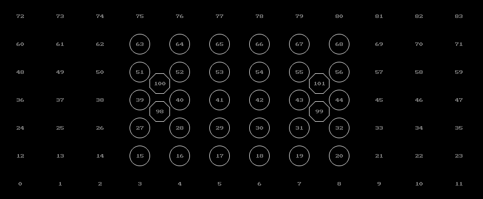
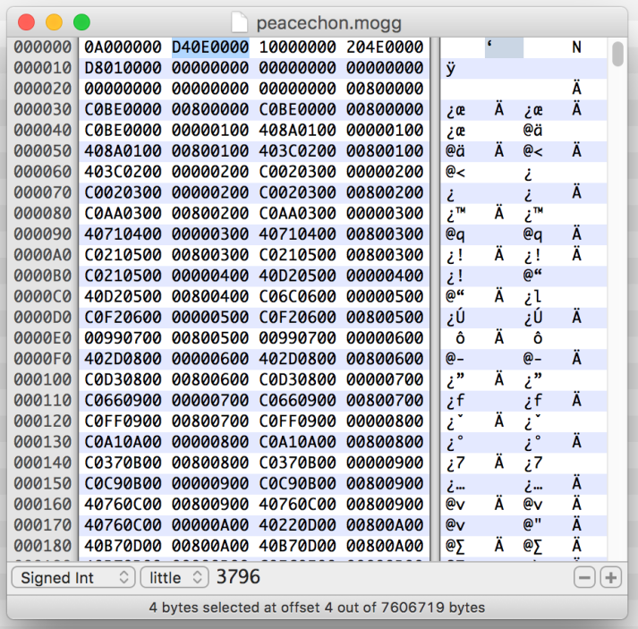
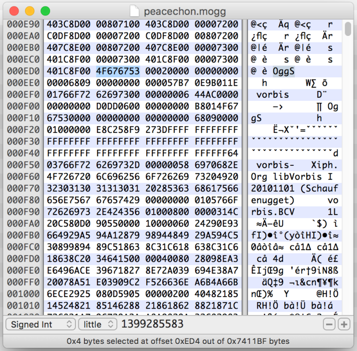

# Files

## .audica

The .audica file is a renamed .zip file packed with the store option. Audica will not read an .audica file that has any kind of compression.

.audica files are read from:

```
<Audica folder>/Audica_Data/StreamingAssets/HmxAudioAssets/songs/
```

## .cues

- `beginner.cues`
- `moderate.cues`
- `advanced.cues`
- `expert.cues`

This is an optional json file containing the information for targets, repeaters, tempo and target speed.

The name of the cues file corresponds to the difficulty: `beginner.cues` for Beginner, `moderate.cues` for Standard, `advanced.cues` for Advanced and `expert.cues` for Expert.

To use cues files you need to specify `false` for `useMidiForCues` in the .desc file

```json
{
    "cues": [
        {
            "tick": 3840,
            "tickLength": 60,
            "pitch": 40,
            "velocity": 20,
            "gridOffset": {
                "x": 0.0,
                "y": 0.0
            },
            "zOffset": 0.0,
            "handType": 2,
            "behavior": 0
        },
    ...
    ],
    "repeaters": [
        {
            "handType": 2,
            "tick": 3840,
            "tickLength": 7680,
            "pitch": 127,
            "velocity": 96
        },
    ...
    ],
    "tempos": [
        {
            "tempo": 128.0,
            "tick": 0
        },
    ...
    ],
    "targetSpeed": 1.0
}
```

### cues

The cues are the targets

#### tick

The amount of MIDI ticks from the start of the song

#### tickLength

The length of the note. This should be set to 120 unless the target is a sustain

#### pitch

This is the [grid] location of the target. Valid values are from 0 to 83

#### velocity

The velocity value controls which sound the target will play when hit.

If you are using a custom drum kit this could be set to any value from 0-127, assuming the drum kit has a sound for that value.

Default drum kits that comes with the game (as well as the OST) uses only 6 velocity values:

| Velocity Value | Description      |
| -------------- | ---------------- |
| 1              | Chain start      |
| 2              | Chain node       |
| 3              | Melee percussion |
| 20             | Kick drum        |
| 60             | Percussion       |
| 127            | Snare drum       |

#### gridOffset

**x**: The offset from the center point of the grid location of the target on the X axis

**y**: The offset from the center point of the grid location of the target on the Y axis

#### zOffset

The Z offset controls the depth of the target

#### handType

The hand used for the target.

| handType Value | Description |
| -------------- | ----------- |
| 0              | Either hand |
| 1              | Right hand  |
| 2              | Left hand   |

#### behavior

The type of target.

| Behavior Value | Description |
| -------------- | ----------- |
| 0              | Normal      |
| 1              | Vertical    |
| 2              | Horizontal  |
| 3              | Sustain     |
| 4              | Chain start |
| 5              | Chain node  |
| 6              | Melee       |
| 7              | Dodge       |

### repeaters

The repeaters are a copy/paste function. It does not serve any purpose in the game.

#### handType

The hand the repeater is saved on. The only valid values are 0, 1 and 2

#### tick

The amount of MIDI ticks from the start of the song

#### tickLength

The length of the repeater.

#### pitch

The pitch used to save this repeater. This should be a value between 102 and 127

#### velocity

This does not serve any purpose for repeaters

### tempos

These are markers for bpm change. In the cues files they do not serve any other purpose than being useful for MIDI conversion. The BPM of the song is always read from the [MIDI file](./#mid) regardless if using MIDI for cues or not.

#### tempo

The tempo of the marker

#### tick

The amount of MIDI ticks from the start of the song

### targetSpeed

This controls the speed of the targets for the whole song. This value is multiplied by the in-game setting.

## .mid

This file is a MIDI file.

The BPM information is required to be in the MIDI file, but the cues (targets) can be encoded either in the MIDI file or the [cues file](./#cues). You can specify if you're using MIDI or not in the [song.desc](./#desc) file of the audica file.

### Ticks Per Quarter Note

This is a midi setting that controls the length of the ticks.

Audica was programmed to use 480 ticks per quarter note, in other word, 1 beat in x/4 = 480 ticks. This setting is a must.

### Tracks

The track name must be a "Track name" event at the very start of the song (1.1.0).

The bare minimum is 3 tracks of one difficulty.

| MIDI Track      | Description                                                                                                  |
| --------------- | ------------------------------------------------------------------------------------------------------------ |
| Expert Melee    | Contains "either hand" targets for expert                                                                    |
| Expert LH       | Contains left hand targets for expert                                                                        |
| Expert RH       | Contains right hand targets for expert                                                                       |
| Hard Melee      | Contains "either hand" targets for advanced                                                                  |
| Hard LH         | Contains left hand targets for advanced                                                                      |
| Hard RH         | Contains right hand targets for advanced                                                                     |
| Normal Melee    | Contains "either hand" targets for standard                                                                  |
| Normal LH       | Contains left hand targets for standard                                                                      |
| Normal RH       | Contains right hand targets for standard                                                                     |
| Easy Melee      | Contains "either hand" targets for beginner                                                                  |
| Easy LH         | Contains left hand targets for beginner                                                                      |
| Easy RH         | Contains right hand targets for beginner                                                                     |
| Community Melee | Contains "either hand" targets for a community map                                                           |
| Community LH    | Contains left hand targets for a community map                                                               |
| Community RH    | Contains right hand targets for a community map                                                              |
| sustain_intro   | Something related to sustain sounds that was used in development, the game currently does not use this track |
| sustain_hard    | Something related to sustain sounds that was used in development, the game currently does not use this track |

The community tracks are used on their own only, for the community maps function of the game.

### Pitch

The pitch (note) controls the position of the targets on the [grid sphere](http://www.audica.wiki/audicawiki/index.php/Grid_Sphere).



0-83 are spots on the grid while 98-101 are melee target spots.

There is also pitches 102-127 that are used for storing repeaters, a copy/paste function enabled by a REAPER Lua script provided by the game files. These pitches are not read by the game.

### Channel

The channel controls the behavior of the target. This only affect the pitch, not the CC values.

This is assuming the channel system starts at 1. If you're not using REAPER the first channel could be 0, if that's the case then substract 1 of each of these channel values.

| Channel Value | Description        |
| ------------- | ------------------ |
| 1             | Regular target     |
| 2             | Horizontal target  |
| 3             | Vertical target    |
| 4             | Chain start target |
| 5             | Chain node         |

The sustain behavior is controlled with then length of the note. Any note with a length higher than 480 ticks (1 beat in x/4) will automatically be considered as a sustain.

The melee behavior is controlled with pitch, there are 4 pitch assigned to be melee targets, depending on the position.

### Velocity

The velocity value controls which sound the target will play when hit.

If you are using a custom drum kit this could be set to any value from 0-127, assuming the drum kit has a sound for that value.

Default drum kits that comes with the game (as well as the OST) uses only 6 velocity values:

| Value | Description      |
| ----- | ---------------- |
| 1     | Chain start      |
| 2     | Chain node       |
| 3     | Melee percussion |
| 20    | Kick drum        |
| 60    | Percussion       |
| 127   | Snare drum       |

### MIDI CC Data

Audica uses CC data to store grid offsets. These CC variables takes 0-127 as data.

| GP slider | Description       |
| --------- | ----------------- |
| 16        | X axis offset     |
| 17        | Y axis offset     |
| 18        | Z axis affset     |
| 19        | X axis big offset |
| 20        | Y axis big offset |
| 21        | Z axis big offset |

For the 3 first values (16, 17, 18) you have to set the value to the middle (63-64) to center the target in the grid point, so 64 is a tiny bit offset to the right while 63 is a tiny bit offset to the left on the X axis.

- X axis (16)
  - 0-63 will nudge the target to the left, 0 being the highest left value, and 63 being the closest to the center
  - 64-127 will nudge the target to the right, 127 being the highest right value, and 64 being the closest to the center
- Y axis (17)
  - 0-63 will nudge the target to the bottom, 0 being the highest bottom value, and 63 being the closest to the center
  - 64-127 will nudge the target to the top, 127 being the highest top value, and 64 being the closest to the center
- Z axis (18)
  - 0-63 will nudge the depth of the target closer to you, 0 being the closest to you, and 63 being the closest to the default depth
  - 64-127 will nudge the depth of the target further away, 127 being as far away as possible, and 64 being the closest to the default depth

The other 3 values (19, 20, 21) will add offset to the main offset values to cover pretty much the entire sphere, this makes it possible to author a 360 degree map/chart. These add the value to their respective axis minus 64, though instead of beind small nudges from the center of the pitch it will add or substract a full grid square.

### Target Speed

It is possible to set the target speed in the MIDI file by adding a text event in the Right Hand track with `targetSpeed 1.0`. This value (1.0) will be multiplied with the in-game target speed setting.

## .moggsong

This file is written in the Harmonix home language often called DTA because of the rock band dta files.

This file controls a mogg file.

The game uses 5 .moggsong files:

### song.moggsong

This controls the main audio file
This is a stereo track

### song_extras.moggsong

This controls the extras audio file which mostly contrains the count-in played before targets appear

This is a stereo track

This track is optional

### song_sustain_l.moggsong

This controls the left sustain audio file

This is a mono track

This track is optional

### song_sustain_r.moggsong

This controls the right sustain audio file

This is a mono track

This track is optional

### song_finale.moggsong

This is the audio for the campaign finale

This is a stereo track

This track is only used for the song "addictedtoamemory"

```
(mogg_path "addictedtoamemory.mogg")
(midi_path "addictedtoamemory.mid")
(tracks
   (
      (mix (0 1) event:/gameplay/song_audio)
   )
)
;
(pans  (-1   1))
(vols  (0   0))
```

### mogg_path

The name of the [mogg file](./#mogg)

### midi_path

The name of the [MIDI file](./#mid)

### tracks

**mix**: This line controls the mix. (0 1) is used for stereo files and (0) for mono files. Sustain audio files are mono, the rest are stereo.

### pans

Controls the pan values. One value per channel.

### vols

Controls the volume values. One value per channel.

## .mogg

This is a multi-track ogg file, used in Harmonix games. The official .mogg files that are released by Harmonix are encrypted.

The only difference with an ogg file is the header.

These files are created using [ogg2mogg](https://github.com/mtolly/ogg2mogg).

```
ogg2mogg input_file.ogg output_file.mogg
```

The game uses 5 .mogg files:

### song.mogg

Contains the main audio (the song)

This is a stereo track

### song_extras.mogg

Contains the count-in (countdown before targets appear) and can contain other sound effects during the song

This is a stereo track

This track is optionnal

### song_sustain_l.mogg

Contains the distorted sound effect for the left gun

This is a mono track

This track is optionnal

### song_sustain_r.mogg

Contains the distorted sound effect for the right gun

This is a mono track

This track is optionnal

### song_finale.mogg

`Contains the music/sound effect for the campaign final

This is a stereo track

This track is only used for the song "addictedtoamemory" which is the campaign finale.

### Converting to .ogg

It is possible to convert an .mogg file to .ogg by removing the header. **Note that this will not work with official Harmonix .mogg files**

Byte 4 is a 4byte little endian number, this number is the address of where the ogg file actually starts. You can then delete everything before that address and you end up with an .ogg file.




In this example the .ogg file starts at 0xED4.

Thanks to [Onyxite](https://github.com/mtolly) for this information and the [ogg2mogg](https://github.com/mtolly/ogg2mogg) software.

## .desc

This is a json file that contains all the metadata. This file must be named `song.desc`.

```json
{
    "songID": "addictedtoamemory",
    "moggSong": "addictedtoamemory.moggsong",
    "title": "Addicted To A Memory",
    "artist": "Zedd ft. Bahari",
    "author": "",
    "midiFile": "addictedtoamemory.mid",
    "targetDrums": "fusion/target_drums/destruct.json",
    "sustainSongRight": "addictedtoamemory_sustain_r.moggsong",
    "sustainSongLeft": "addictedtoamemory_sustain_l.moggsong",
    "fxSong": "addictedtoamemory_extras.moggsong",
    "songEndEvent": "event:/song_end/song_end_C#",
    "highScoreEvent": "event:/results/results_high_score_C#",
    "songEndPitchAdjust": 0.0,
    "prerollSeconds": 0.5,
    "previewStartSeconds": 61.2239990234375,
    "useMidiForCues": false,
    "hidden": false
}
```

### songID

Unique ID of the song

### moggSong

The name of the [moggsong file](./#moggsong) that controls the main mogg file

### title

Name of the song

### artist

The artist that created this song

### author

The name of the person who created the map/chart
If this field is empty, the "Mapper" field on the song's button will not show up.

### midiFile

The name of the [MIDI file](./#mid)

### targetDrums

The location of the drum kit metadata file

### sustainSongRight

The name of the [moggsong file](./#moggsong) that controls the right sustain mogg file

This file is optionnal, you can remove the value and have "" as the string value if you do not wish to use this file

### sustainSongLeft

The name of the [moggsong file](./#moggsong) that controls the left sustain mogg file

This file is optionnal, you can remove the value and have "" as the string value if you do not wish to use this file

### fxSong

The name of the [moggsong file](./#moggsong) that controls the extras mogg file

This file is optionnal, you can remove the value and have "" as the string value if you do not wish to use this file

### songEndEvent

The event played at the end of the song

### highScoreEvent

The event played at the high score popup

### songEndPitchAdjust

Adjustment value for the pitch used for the end event

### prerollSeconds

Amount of time to wait before starting the song; this does not affect audio

### previewStartSeconds

The time in seconds when the song preview starts

### useMidiForCues

If set to `True`, the game will load cues from the [MIDI file](./#mid) instead
of the [cues files](./#cues)

### hidden

If set to `True`, song will be hidden. This is only used for the tutorial song

### Old values

These values are no longer used by the game. If you find those, you are looking at an old song.desc file. All the OST songs were updated with the new `targetDrums`.

#### fusionSpatialized

Location of the spatial fusion file

#### fusionUnspatialized

Location of the sub fusion file

## extrafriends.json

This file is for storing cross-platform friends. Not available for PSVR.

```json
{
    "friends": [
        {
            "leaderboard_friend_id": "44fcf4a6-6566-4a61-92e7-2d645db60e5f",
            "name": "CoachTony"
        },
        ...
    ]
}
```

On PC this file is stored in `AppData\LocalLow\Harmonix Music Systems, Inc_\Audica`. You can find your own friend code in the game just by using the Copy function in Settings > Friends.

On Quest this file is stored in `PC\Quest\Internal shared storage\Android\data\com.harmonixmusic.kata\files`. Currently the only ways to get your friend code is either the PC method using the Rift version of the game, or join the Modding Discord Server, go in the #leaderboards channel and use the .findfriendcode "your_username" command (quotes are only necessary if the username contains spaces). The requested friend code will only show up if the player has played at least one song.

