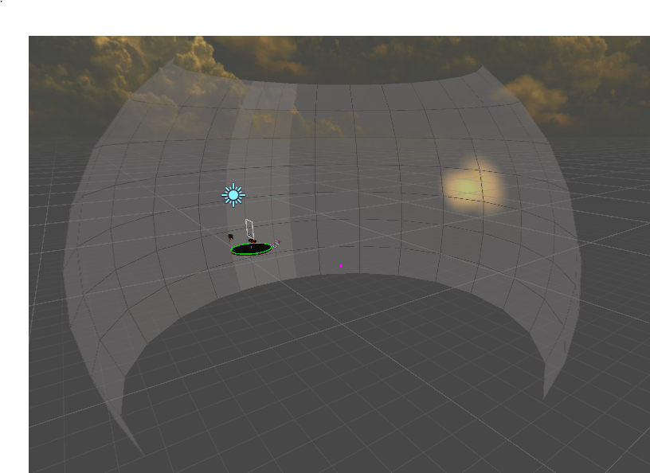
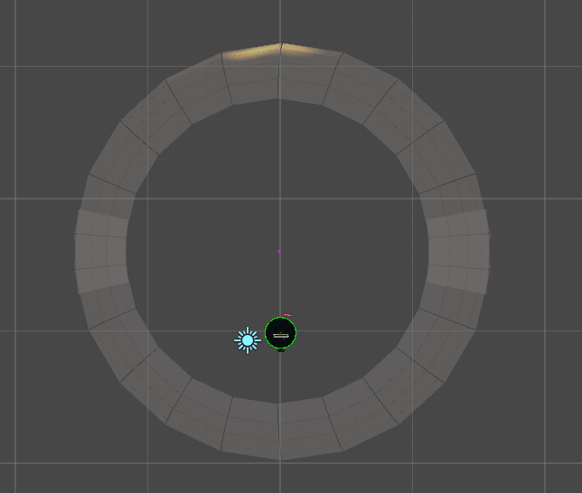
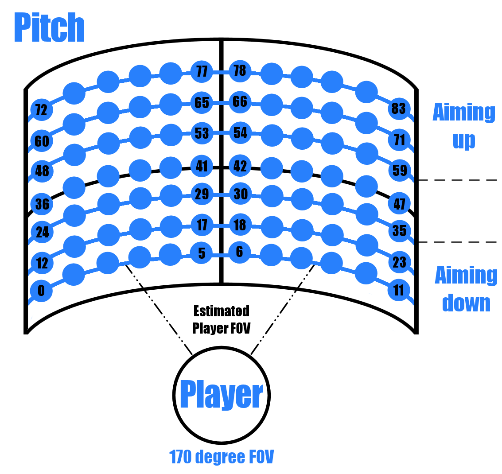

# Misc

## Scoring

This page is mostly a copy paste of this
[guide](https://steamcommunity.com/sharedfiles/filedetails/?id=1725944274)
made by drasticsurgeon (anticrepuscular in the [Harmonix discord
server](https://discord.gg/Harmonix)).

### Introduction

Audica has a fairly complex scoring system. This guide breaks down how
the scores are calculated for each target type and also covers the
multiplier system.

The details below are based on playing the game and watching recordings,
along with comments from the developers.

### Standard/Slot Targets

Standard and slot (horizontal/vertical) targets use the same scoring
system. They're worth up to 2000 points each:

| Base | Timing | Aim | Total |
| ---- | ------ | --- | ----- |
| 500  | 750    | 750 | 2000  |

### Sustain Targets

Sustain targets are worth up to 3000 points each. Base/Timing/Aim give
the same points as for standard targets, depending on how you hit the
target at the start of the sustain.

Hold points are given for keeping the trigger pressed until the end of
the sustain (or later). Note that you don't have to release the trigger
"on time"; you can keep it pressed past the end of the sustain and still
get the maximum.

After the initial hit of a sustain target there are no further points
for aim. This means you can start aiming at the next target early, or
just rest your arm for a while\!

Sustain targets are added to your streak upon the initial hit, but the
points are not added until the end of the sustain.

| Base | Timing | Aim | Hold | Total |
| ---- | ------ | --- | ---- | ----- |
| 500  | 750    | 750 | 1000 | 3000  |

### Chain Targets

Chain targets begin with a start target and continue with sub-targets.
You have to shoot the chain start target and keep the trigger pressed
until the chain is finished. The gun will autofire at the sub-targets in
time with the music.

The chain start target is scored in exactly the same way as a standard
target:

| Base | Timing | Aim | Total |
| ---- | ------ | --- | ----- |
| 500  | 750    | 750 | 2000  |

The chain sub-targets are scored lower because they're more frequent.
There's no timing component to the score because the gun automatically
fires to hit them on time.

| Base | Aim | Total |
| ---- | --- | ----- |
| 50   | 75  | 125   |

### Melee Targets

Melee targets are worth up to 2000 points each. To get full points for
velocity you need to be moving the controller faster than the (unknown)
speed threshold for at least 0.1 seconds. This is checked during a 0.2
second window around the arrival time of the melee target.

| Base | Velocity | Total |
| ---- | -------- | ----- |
| 1000 | 1000     | 2000  |

### Streak/Multiplier System

The game tracks how many consecutive targets you've hit without missing
or misfiring; this is your streak count. Releasing the trigger before
the end of a sustain or chain target will reset your streak count too.

A multiplier is applied to target scores based on your streak count:

| Streak Count | Multiplier |
| ------------ | ---------- |
| 1-9          | 1x         |
| 10-19        | 2x         |
| 20-29        | 3x         |
| 30+          | 4x         |

The streak count is updated before the points for the target are
applied, so the 10th target you hit in a streak gets a 2x multiplier.

### Stars cutoff

Stars are calculated based on the max possible score. You have to reach
a certain percentage.

| Stars              | Percentage |
| ------------------ | ---------- |
| Gold (Expert Only) | \>90%      |
| Five               | \>63.5%    |
| Four               | \>42.5%    |
| Three              | \>26.5%    |
| Two                | \>10%      |
| One                | \>0%       |

## Original Soundtrack

### Main Songs

This is a list of the songs that comes with the game when you purchase
it.

| Song                                            | Artist                                         | Author (Mapper)   | songID                   | Release Date     |
| ----------------------------------------------- | ---------------------------------------------- | ----------------- | ------------------------ | -----------------|
| Addicted To A Memory                            | Zedd ft. Bahari                                | HMXRick           | addictedtoamemory        | June 10, 2019    |
| Adrenaline                                      | Zedd & Grey                                    | HMXJeff           | adrenaline               | March 7, 2019    |
| Boom Boom                                       | Iggy Azalea ft. Zedd                           | HMXJeff & HMXRick | boomboom                 | April 3, 2019    |
| Break For Me                                    | James Landino ft. Noelle LeBlanc               | HMXRick           | breakforme               | May 24, 2019     |
| Channel 42                                      | deadmau5 & Wolfgang Gartner                    | HMXRick           | channel42                | November 5, 2019 |
| Collider                                        | Noisia                                         | HMXJeff           | collider                 | March 7, 2019    |
| Decode Me                                       | inter:sect ft. Noelle LeBlanc & Naoko Takamoto | ProtoPip          | decodeme                 | August 28, 2019  |
| Destiny                                         | 1788-L & Blanke                                | HMXJeff           | destiny                  | March 7, 2019    |
| Everyday                                        | Logic & Marshmello                             | HMXRick           | everyday                 | November 5, 2019 |
| Eye For An Eye                                  | ELYXR                                          | Simon             | eyeforaneye              | August 28, 2019  |
| Game Time                                       | 3Lau ft. Ninja                                 | HMXRick           | gametime                 | April 18, 2019   |
| G.O.A.T.                                        | Polyphia                                       | Simon             | goatpolyphia             | November 5, 2019 |
| Gold Dust                                       | DJ Fresh ft. Ms. Dynamite                      | HMXJeff           | golddust                 | March 7, 2019    |
| HR 8938 Cephei                                  | deadmau5                                       | HMXJeff           | hr8938cephei             | May 1, 2019      |
| Highway To Oblivion                             | DragonForce                                    | HMXRick           | highwaytooblivion\_short | July 30, 2019    |
| I Feel Love (Afrojack Remix)                    | Donna Summer                                   | HMXJeff           | ifeellove                | March 7, 2019    |
| I Want U                                        | Alison Wonderland                              | HMXJeff           | iwantu                   | March 7, 2019    |
| Illmerica                                       | Wolfgang Gartner                               | Simon             | illmerica                | November 5, 2019 |
| Lazerface                                       | Jeff Allen                                     | HMXJeff           | lazerface                | March 7, 2019    |
| Loyal                                           | ODESZA                                         | Simon & HMXRick   | loyal                    | November 5, 2019 |
| Overtime                                        | KNOWER                                         | HMXRick           | overtime                 | May 1, 2019      |
| POP/STARS                                       | K/DA ft. Madison Beer, (G)I-DLE, Jaira Burns   | HMXJeff           | popstars                 | March 20, 2019   |
| Perfect (Exceeder)                              | Mason vs Princess Superstar                    | HMXJeff           | perfectexceeder          | June 10, 2019    |
| Predator                                        | M-Cue                                          | HMXJeff           | predator                 | April 18, 2019   |
| Raise Your Weapon (Noisia Remix)                | deadmau5                                       | HMXJeff & HMXRick | raiseyourweapon\_noisia  | March 20, 2019   |
| Resistance                                      | Knife Party                                    | HMXJeff           | resistance               | May 24, 2019     |
| Smoke                                           | Au5 & Fractal                                  | HMXJeff           | smoke                    | March 7, 2019    |
| Splinter                                        | Savant                                         | HMXJeff           | splinter                 | March 7, 2019    |
| Synthesized (Audica Remix)                      | Symbion Project                                | HMXJeff           | synthesized              | April 3, 2019    |
| The Space                                       | James Egbert                                   | HMXJeff           | thespace                 | March 7, 2019    |
| Time For Crime                                  | ORION                                          | HMXJeff & HMXRick | timeforcrime             | June 26, 2019    |
| Titanium (Cazzette's Ant Seeking Hamster Remix) | David Guetta ft. Sia                           | HMXJeff           | titanium\_cazzette       | November 5, 2019 |
| To The Stars                                    | Feed Me                                        | HMXRick           | tothestars               | June 26, 2019    |
|                                                 |                                                |                   |                          |                  |

### Extras

This is a list of the songs that comes with the game when you purchase
it.

The campaign column shows which difficulty you need to complete it to
unlock the song. Playing the campaign on a higher difficulty will unlock
any song that is unlocked through lower difficulties.

| Song                                 | Artist                                       | songID                  | Campaign | Release Date     |
| ------------------------------------ | -------------------------------------------- | ----------------------- | -------- | -----------------|
| Addicted To A Memory (Album Version) | Zedd ft. Bahari                              | addictedtoamemory\_full | Advanced | November 5, 2019 |
| Destiny (Album Version)              | 1788-L & Blanke                              | destiny\_full           | Beginner | November 5, 2019 |
| Highway To Oblivion (Album Version)  | DragonForce                                  | highwaytooblivion\_full | Expert   | July 30, 2019    |
| POP/STARS (Album Version)            | K/DA ft. Madison Beer, (G)-IDLE, Jaira Burns | popstars\_full          | Moderate | November 5, 2019 |

#### PSVR Exclusives

These songs were timed exclusives for PS4 players. The exclusivity ended
January 28, 2020.

| Song                                                     | Artist                         | songID           | Release Date     |
| -------------------------------------------------------- | ------------------------------ | ---------------- | -----------------|
| Exit Wounds                                              | James Egbert ft. Nina Sung     | exitwounds       | November 5, 2019 |
| Funky Computer                                           | James Landino                  | funkycomputer    | November 5, 2019 |
| Reeds of Mitatrush                                       | asms                           | reedsofmitatrush | November 5, 2019 |
| We All Become (from the Transistor: Original Soundtrack) | Darren Korb ft. Ashley Barrett | weallbecome      | November 5, 2019 |

#### Downloadable Content

These songs are optional downloads from the platform's stores.

On Viveport, the packs and seasons pass are not available.

"Exit Wounds", "Funky Computer", "Reeds of Mitatrush" and "We All
Become" were released November 5th 2019 on PS4 as exclusive content.

| Song                                                     | Artist                                    | Author (Mapper) | songID               | Pack        | Season Pass      | Release Date      |
| -------------------------------------------------------- | ----------------------------------------- | --------------- | -------------------- | ----------- | ---------------- | ------------------|
| All Stars                                                | Radio Compass                             | HMXRick         | allstars             | None        | None             | December 18, 2020 |
| Avalanche                                                | Bex                                       | HMXRick         | avalanche            | None        | None             | May 11, 2020      |
| bad guy                                                  | Billie Eilish                             | HMXRick         | badguy               | DLC Pack 01 | Season Pass 2019 | November 5, 2019  |
| Believer                                                 | Imagine Dragons                           | HMXRick         | believer             | DLC Pack 01 | Season Pass 2019 | November 5, 2019  |
| Better Now                                               | Post Malone                               | HMXRick         | betternow            | DLC Pack 01 | Season Pass 2019 | November 5, 2019  |
| Can't Feel My Face                                       | The Weeknd                                | HMXRick         | cantfeelmyface       | DLC Pack 04 | None             | January 28, 2020  |
| Centuries                                                | Fall Out Boy                              | HMXRick         | centuries            | DLC Pack 02 | Season Pass 2019 | November 27, 2019 |
| Counting Stars                                           | OneRepublic                               | HMXRick         | countingstars        | DLC Pack 02 | Season Pass 2019 | November 27, 2019 |
| Don't Let Me Down                                        | The Chainsmokers ft. Daya                 | HMXRick         | dontletmedown        | DLC Pack 03 | Season Pass 2019 | December 19, 2019 |
| Exit Wounds                                              | James Egbert ft. Nina Sung                | HMXRick         | exitwounds           | None        | None             | January 28, 2020  |
| Funky Computer                                           | James Landino                             | Simon           | funkycomputer        | None        | None             | January 28, 2020  |
| GDFR                                                     | Flo Rida ft. Sage The Gemini and Lookas   | HMXRick         | gdfr                 | DLC Pack 04 | None             | January 28, 2020  |
| Girls Be Dancing                                         | Party Bois                                | HMXRick         | girldsbedancing      | None        | None             | May 11, 2020      |
| High Hopes                                               | Panic\! At The Disco                      | aggrogahu       | highhopes            | DLC Pack 02 | Season Pass 2019 | November 27, 2019 |
| How We Know (Bungle Bot Remix)                           | Sleeping Lion & Cass Miller ft. Bugle Bot | HMXRick         | howweknow            | None        | None             | December 18, 2020 |
| Into You                                                 | Ariana Grande                             | HMXRick         | intoyou              | DLC Pack 01 | Season Pass 2019 | November 5, 2019  |
| Juice                                                    | Lizzo                                     | HMXRick         | juice                | DLC Pack 04 | None             | January 28, 2020  |
| Long Run                                                 | Hausman & Jenni Rudolph ft. Lys           | HMXRick         | longrun              | None        | None             | May 11, 2020      |
| Methane Breather                                         | asms                                      | HMXRick         | methanebreather      | None        | None             | March 05, 2020    |
| Moves Like Jagger                                        | Maroon 5 ft. Christina Aguilera           | HMXRick         | moveslikejagger      | DLC Pack 02 | Season Pass 2019 | November 27, 2019 |
| New Rules                                                | Dua Lipa                                  | HMXRick         | newrules             | DLC Pack 03 | Season Pass 2019 | December 19, 2019 |
| Pre-Existing Condition                                   | I Was Awake                               | HMXRick         | preexistingcondition | None        | None             | December 18, 2020 |
| Reeds of Mitatrush                                       | asms                                      | HMXJeff         | reedsofmitatrush     | None        | None             | January 28, 2020  |
| Sorry For Party Rocking                                  | LMFAO                                     | HMXRick         | sorryforpartyrocking | DLC Pack 02 | Season Pass 2019 | November 27, 2019 |
| Starships                                                | Nicki Minaj                               | HMXRick         | starships            | DLC Pack 03 | Season Pass 2019 | December 19, 2019 |
| Stook (Audica Mix)                                       | Simaniac                                  | HMXRick         | stook                | None        | None             | March 19, 2020    |
| The Greatest                                             | Sia ft. Kendrick Lamar                    | HMXRick         | thegreatest          | DLC Pack 03 | Season Pass 2019 | December 19, 2019 |
| The Middle                                               | Zedd, Maren Morris & Grey                 | HMXRick         | themiddle            | DLC Pack 03 | Season Pass 2019 | December 19, 2019 |
| The Mother We Share                                      | CHVRCHES                                  | HMXRick         | themotherweshare     | DLC Pack 04 | None             | January 28, 2020  |
| U R Prey                                                 | M-Cue                                     | HMXRick         | urprey               | None        | None             | February 20, 2020 |
| We All Become (From the Transistor: Original Soundtrack) | Darren Korb ft. Ashley Barrett            | HMXRick         | weallbecome          | None        | None             | January 28, 2020  |
| Youngblood                                               | 5 Seconds of Summer                       | HMXRick         | youngblood           | DLC Pack 01 | Season Pass 2019 | November 5, 2019  |

## Grid Sphere

Each rectangle on this grid represents a pitch in the cues and midi
files.

It is possible to go beyond the grid and create a 360 degrees map/chart
by using big offset numbers in the cues file or the big offset CC values
in the MIDI file.

There is also grid spots at the top and bottom of the normal grid, even
though they're not shown in these pictures. There is 5 rows above and 8
rows below that people can use with target offsets.

### View From Far Back

### Top View

### Pitch Placement

